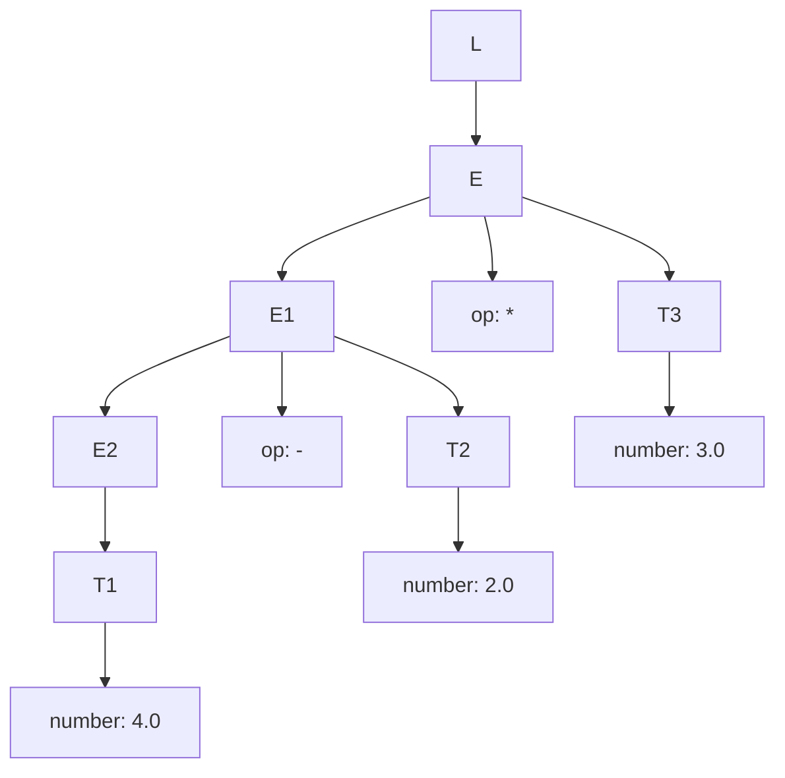
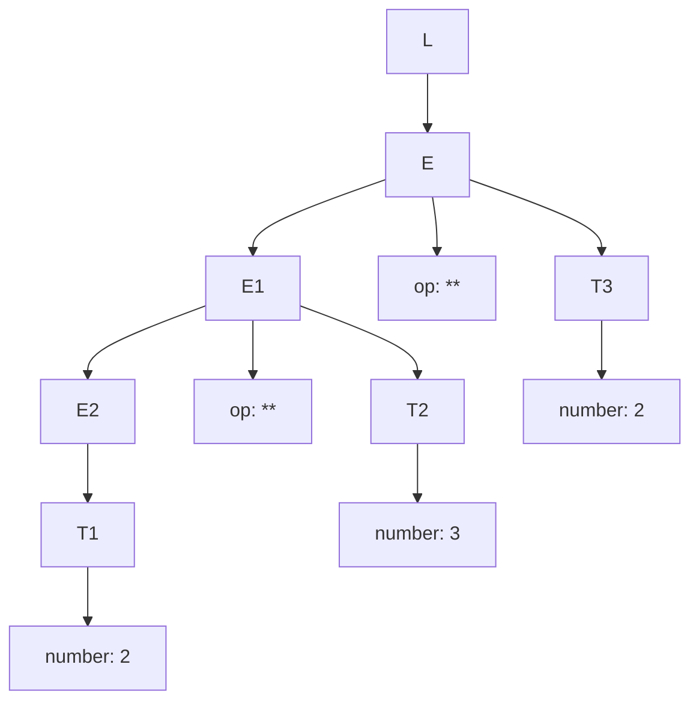
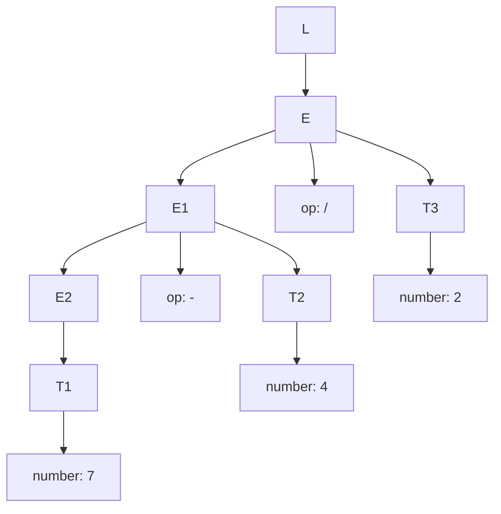

# Práctica 5: Traducción Dirigida por la Sintaxis: Gramática

Esta práctica tiene como objetivo aplicar la **traducción dirigida por la sintaxis (SDD)** para
implementar con Jison una calculadora aritmética sencilla. A partir de una gramática anotada con
reglas semánticas, se construye un analizador capaz de evaluar expresiones con números enteros
y en punto flotante.

El contexto de la práctica parte del repositorio utilizado en la práctica anterior, que ya contenía
una implementación básica en Jison para una calculadora. En esta sesión de laboratorio se
profundiza en:

- **Definir y analizar** la SDD original y sus limitaciones respecto a precedencia y asociatividad.
- **Modificar la gramática** para respetar los convenios matemáticos habituales.
- **Extender el lenguaje** con soporte completo para números en punto flotante y expresiones
  entre paréntesis.
- **Validar el comportamiento** mediante un conjunto de tests automáticos con Jest.

## Desarrollo

### 1. Partiendo de la gramática y las siguientes frases 4.0-2.0*3.0, 2\*\*3\*\*2 y 7-4/2:

#### 1.1. Escriba la derivación para cada una de las frases

- **4.0-2.0\*3.0**:  
  $$L \Rightarrow E\,\text{eof} \Rightarrow E * T\,\text{eof} \Rightarrow E * 3.0\,\text{eof} \Rightarrow E - T * 3.0\,\text{eof} \Rightarrow E - 2.0 * 3.0\,\text{eof} \Rightarrow T - 2.0 * 3.0\,\text{eof} \Rightarrow 4.0 - 2.0 * 3.0\,\text{eof}$$

- **2\*\*3\*\*2**:  
  $$L \Rightarrow E\,\text{eof} \Rightarrow E\,\text{**}\ T\,\text{eof} \Rightarrow E\,\text{**}\ 2\,\text{eof} \Rightarrow E\,\text{**}\ T\,\text{**}\ 2\,\text{eof} \Rightarrow E\,\text{**}\ 3\,\text{**}\ 2\,\text{eof} \Rightarrow T\,\text{**}\ 3\,\text{**}\ 2\,\text{eof} \Rightarrow 2\,\text{**}\ 3\,\text{**}\ 2\,\text{eof}$$

- **7-4/2**:  
  $$L \Rightarrow E\,\text{eof} \Rightarrow E / T\,\text{eof} \Rightarrow E / 2\,\text{eof} \Rightarrow E - T / 2\,\text{eof} \Rightarrow E - 4 / 2\,\text{eof} \Rightarrow T - 4 / 2\,\text{eof} \Rightarrow 7 - 4 / 2\,\text{eof}$$

En los tres casos la gramática fuerza una **asociatividad por la izquierda** y no distingue entre
precedencias de operadores: todos los `op` se tratan igual.

#### 1.2. Escriba el árbol de análisis sintáctico (parse tree) para cada una de las frases

Para representar los árboles utilizo mermaid y la gramática original.

- **4.0-2.0\*3.0** \(\Rightarrow ((4.0 - 2.0) * 3.0)\)

- **2\*\*3\*\*2** \(\Rightarrow ((2 ** 3) ** 2)\)

- **7-4/2** \(\Rightarrow ((7 - 4) / 2)\)

#### 1.3. ¿En qué orden se evalúan las acciones semánticas para cada una de las frases?

En esta SDD las acciones semánticas se aplican **de abajo hacia arriba en el árbol de análisis**:
primero se calculan los atributos de los nodos `T` (con `convert(number.lexvalue)`) y después los
de los nodos `E` (con `operate(op.lexvalue, E1.value, T.value)`), siguiendo la estructura
impuesta por `E → E op T`.

Aplicado a cada frase:

- **4.0-2.0\*3.0**  
  1. Se convierten los tres `number` a valores: `4.0`, `2.0` y `3.0`.  
  2. Se evalúa primero `E1.value = operate('-', 4.0, 2.0)` ⇒ \(4.0 - 2.0 = 2.0\).  
  3. Después se evalúa `E.value = operate('*', E1.value, 3.0)` ⇒ \(2.0 * 3.0 = 6.0\).  
  El resultado es `6.0`, que **no respeta la precedencia esperada** (debería ser `4.0 - (2.0*3.0)`).

- **2\*\*3\*\*2**  
  1. Se convierten los `number`: `2`, `3` y `2`.  
  2. Primero se calcula `operate('**', 2, 3)` ⇒ \(2 ** 3 = 8\).  
  3. Luego `operate('**', 8, 2)` ⇒ \((2 ** 3) ** 2 = 64\).  
  El operador potencia se aplica como **asociativo por la izquierda**, en lugar de por la derecha.

- **7-4/2**  
  1. Se convierten `7`, `4` y `2`.  
  2. Primero se evalúa `operate('-', 7, 4)` ⇒ \(7 - 4 = 3\).  
  3. Luego `operate('/', 3, 2)` ⇒ \((7 - 4) / 2 = 1.5\).  
  De nuevo, el resultado corresponde a una agrupación \((7 - 4) / 2\) y no a la precedencia habitual
  \(7 - (4 / 2)\).

En resumen, la SDD original **no distingue precedencia entre operadores** y fuerza una
asociatividad por la izquierda en todos los casos, por lo que la evaluación no coincide con los
convenios matemáticos ni con los de los lenguajes de programación habituales.
En consecuencia, cuando se añaden los tests de precedencia en `prec.test.js` (punto 1.4 del guión),
la implementación original **no respeta la precedencia ni la asociatividad esperadas** y varias
pruebas fallan, evidenciando la necesidad de modificar la gramática.

### 2. Modificación de la gramática para respetar precedencia y asociatividad

En el fichero `src/grammar.jison` se ha reestructurado la gramática para separar claramente los
distintos niveles de precedencia:

- **`expression`**: maneja los operadores aditivos `+` y `-` (token `OPAD`), asociativos por la izquierda.
- **`expression_mu`**: maneja los operadores multiplicativos `*` y `/` (token `OPMU`), también
  asociativos por la izquierda y con mayor precedencia que `expression`.
- **`expression_pow`**: maneja el operador de potencia `**` (token `OPOW`), asociativo por la
  derecha y con mayor precedencia que los operadores multiplicativos.

Para cada nivel se aplica la función `operate(op, left, right)` de forma que la estructura de la
gramática refleja directamente la precedencia y la asociatividad descritas en el guión de la práctica.

### 3. Tests de precedencia y asociatividad con flotantes

Además de los tests ya existentes en `__tests__/parser.test.js`, se ha creado el fichero
`__tests__/prec.test.js` con un conjunto ampliado de pruebas:

- **Pruebas con números enteros** (las indicadas en el enunciado) para verificar que, tras la
  modificación de la gramática, ahora:
  - La multiplicación y la división se evalúan antes que la suma y la resta.
  - La potencia tiene la máxima precedencia.
  - La potencia es asociativa por la derecha.
- **Pruebas con números en punto flotante**, usando notaciones como `2.35e-3`, `2.35e+3`,
  `2.35E-3`, `2.35`, `23` y `2E+3`, combinadas en expresiones aritméticas para comprobar que
  se respeta la misma precedencia y asociatividad que con enteros.

Estas pruebas se apoyan en `toBeCloseTo` de Jest para comprobar resultados con decimales.

### 4. Soporte de expresiones entre paréntesis

En el mismo fichero `src/grammar.jison` se ha añadido soporte para **expresiones entre paréntesis**
tal y como indica el guión:

- En el **léxico**, se han introducido los tokens `LEFT_PARENTHESIS` y `RIGHT_PARENTHESIS` para
  reconocer `(` y `)`.
- En la **gramática**, se ha definido el no terminal `parenthesis_or_number`:
  - `NUMBER` se convierte directamente en un valor numérico (`Number(yytext)`).
  - `( expression )` devuelve el valor de la subexpresión interna, implementando la regla
    `F → ( E )` del guión.
- El no terminal `expression_pow` se ha redefinido para que trabaje sobre `parenthesis_or_number`,
  lo que permite combinar paréntesis con el operador de potencia respetando la precedencia.

Con estos cambios, las expresiones entre paréntesis se evalúan correctamente y pueden anidarse.

### 5. Tests para expresiones entre paréntesis

Finalmente, en `__tests__/prec.test.js` se ha añadido un bloque específico de tests para
comprobar el comportamiento de los paréntesis:

- **Sobrescritura de la precedencia por defecto**:
  - Expresiones como `(1 + 2) * 3`, `2 * (3 + 4)` o `(1 + 2) * (3 + 4)` demuestran que los
    paréntesis fuerzan el orden de evaluación esperado.
- **Paréntesis anidados**:
  - Casos como `((1 + 2) * (3 + 4))` o `10 - (2 * (3 + 4))` verifican el manejo de anidamiento.
- **Combinación con potencia y flotantes**:
  - Expresiones como `(2 + 3) ** 2`, `2 ** (1 + 2)` o `(1.5 + 2.5) * 2` validan que los paréntesis
    interactúan correctamente con el operador de potencia y con números en punto flotante.

## Resultados

Tras las modificaciones realizadas:

- La **gramática Jison respeta la precedencia y la asociatividad** de los operadores aditivos,
  multiplicativos y de potencia, de acuerdo con los convenios matemáticos habituales.
- El analizador es capaz de **reconocer y evaluar correctamente números en punto flotante** en
  distintas notaciones (con y sin exponente).
- Se ha añadido soporte completo para **expresiones entre paréntesis**, incluyendo anidamiento y
  combinación con potencia.
- Todos los tests definidos en `parser.test.js` y `prec.test.js` se ejecutan correctamente,
  proporcionando evidencia automática de que la implementación cumple los requisitos de la práctica.